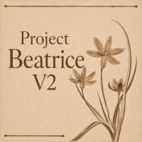

<div align="center">



# Project Beatrice V2 — Official Website & Documentation Portal

**The official modern web portal, documentation hub, and interactive showcase for the Project Beatrice V2 real-time neural voice conversion ecosystem.**

[](https://project-beatrice-v2.github.io/website/)
[](https://github.com/Project-Beatrice-V2)
[](LICENSE)
[](https://github.com/Project-Beatrice-V2/website/actions)

</div>

---

## 🌿 Overview

This repository powers the official web application for **[Project Beatrice V2](https://github.com/Project-Beatrice-V2)**. It provides:
- **Interactive Audio & Waveform Player**: In-browser speech synthesis and formant acoustic audition.
- **Multilingual Support (i18n)**: Full native localization for English (`en`), 日本語 (`ja`), and 中文 (`zh`).
- **Real-Time Module Directory**: Live GitHub stars and direct links to all Beatrice repositories.
- **Pre-Trained Voice Models Hub**: Direct model downloads for Hugging Face and GitHub-hosted weights.
- **Interactive Installation Steppers**: Guides for macOS (Metal/MPS), Windows (CUDA/DirectML), and Google Colab cloud workflows.

---

## 🛠️ Technology Stack

- **Framework**: React 19 + TypeScript + Vite
- **Styling**: Tailwind CSS + Custom "Digital Archivalism" Parchment Design System
- **Animations**: Framer Motion + GSAP ScrollTrigger + Lenis Smooth Scrolling
- **Icons**: Lucide React
- **Deployment**: GitHub Pages + Vercel

---

## 🚀 Local Development

```bash
# Clone repository
git clone https://github.com/Project-Beatrice-V2/website.git
cd website

# Install dependencies
npm install

# Start local dev server
npm run dev

# Build production bundle
npm run build
```

---

## 📜 License

Licensed under the [MIT License](LICENSE) — free for personal and open-source use.
